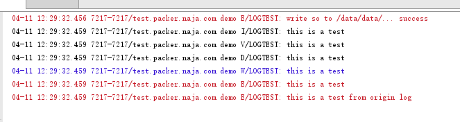

# 爱加密加固之后打印日志

最近在爱加密加固之后，用xposed去打印日志，开始用log.i一直打不出来，以为是插件有问题，后来才发现爱加密加固之后只有Log.e才能够打出日志。虽然Log.e打日志也可以，但是作为重度强迫症患者，一堆错误的日志看得很头疼

> 声明一下，我水平有限，不要骂我，谢谢

## 猜测

我试着用dlsym去调用Log在native层对应的方法`android_util_Log_println_native`，以及在其中调用的`__android_log_buf_write`方法直接去写日志，发现并不能够吧日志写出了，所以爱加密应该劫持了这些函数，并且在不是错误日志的时候都不把日志打出来

## Log的原理

你可以跟踪log的源码，然后分析其原理，其实打印日志就是对/dev/log/下面的设备文件进行操作，在Log的d,i,v,w,e这些方法中都是写到`/dev/log/main`这个文件里面的。我们先简单分析一下源码

首先是java层的代码代码位置在`frameworks\base\core\java\android\util\Log.java`。我们可以发现，打印日志最终都是调用的这个native方法

```java
...
public static int i(String tag, String msg) {
  return println_native(LOG_ID_MAIN, INFO, tag, msg);
}
...

/** @hide */ public static native int println_native(int bufID,
            int priority, String tag, String msg);
```

我们看这个native方法实现的地方，在安卓源码的`frameworks\base\core\jni\android_util_Log.cpp`这个位置，在这个里面，发现就只是调用了`__android_log_buf_write`这个方法来打印日志，前面做了一些判断

```cpp
/*
 * In class android.util.Log:
 *  public static native int println_native(int buffer, int priority, String tag, String msg)
 */
static jint android_util_Log_println_native(JNIEnv* env, jobject clazz,
        jint bufID, jint priority, jstring tagObj, jstring msgObj)
{
    const char* tag = NULL;
    const char* msg = NULL;

    if (msgObj == NULL) {
        jniThrowNullPointerException(env, "println needs a message");
        return -1;
    }

    if (bufID < 0 || bufID >= LOG_ID_MAX) {
        jniThrowNullPointerException(env, "bad bufID");
        return -1;
    }

    if (tagObj != NULL)
        tag = env->GetStringUTFChars(tagObj, NULL);
    msg = env->GetStringUTFChars(msgObj, NULL);

    int res = __android_log_buf_write(bufID, (android_LogPriority)priority, tag, msg);

    if (tag != NULL)
        env->ReleaseStringUTFChars(tagObj, tag);
    env->ReleaseStringUTFChars(msgObj, msg);

    return res;
}
```

接下来我们继续跟踪到`__android_log_buf_write`方法定义的位置，在安卓源码的`system\core\liblog\logd_write.c`中，这里在前面讲log的等级以及tag和log的消息装在一个结构体数组里面，然后调用了write_to_log打印日志

```cpp
int __android_log_buf_write(int bufID, int prio, const char *tag, const char *msg)
{
    struct iovec vec[3];
    char tmp_tag[32];

    if (!tag)
        tag = "";

    /* XXX: This needs to go! */
    if ((bufID != LOG_ID_RADIO) &&
         (!strcmp(tag, "HTC_RIL") ||
        !strncmp(tag, "RIL", 3) || /* Any log tag with "RIL" as the prefix */
        !strncmp(tag, "IMS", 3) || /* Any log tag with "IMS" as the prefix */
        !strcmp(tag, "AT") ||
        !strcmp(tag, "GSM") ||
        !strcmp(tag, "STK") ||
        !strcmp(tag, "CDMA") ||
        !strcmp(tag, "PHONE") ||
        !strcmp(tag, "SMS"))) {
            bufID = LOG_ID_RADIO;
            // Inform third party apps/ril/radio.. to use Rlog or RLOG
            snprintf(tmp_tag, sizeof(tmp_tag), "use-Rlog/RLOG-%s", tag);
            tag = tmp_tag;
    }

    vec[0].iov_base   = (unsigned char *) &prio;
    vec[0].iov_len    = 1;
    vec[1].iov_base   = (void *) tag;
    vec[1].iov_len    = strlen(tag) + 1;
    vec[2].iov_base   = (void *) msg;
    vec[2].iov_len    = strlen(msg) + 1;

    return write_to_log(bufID, vec, 3);
}
```

我们再看`write_to_log`这个方法，这是前面定义的一个函数指针，他的初始值是指向`__write_to_log_init`这个方法。这里面重点来了，他做了一下初始化，就是把日志这些设备文件打开，然后重新把`write_to_log`指针指向`__write_to_log_kernel`这个方法，也就是保证初始化完成之后，再使用这个函数指针调用函数的时候就不去做设备文件打开的操作了。

```cpp
static int __write_to_log_init(log_id_t log_id, struct iovec *vec, size_t nr)
{
#ifdef HAVE_PTHREADS
    pthread_mutex_lock(&log_init_lock);
#endif

    if (write_to_log == __write_to_log_init) {
        log_fds[LOG_ID_MAIN] = log_open("/dev/"LOGGER_LOG_MAIN, O_WRONLY);
        log_fds[LOG_ID_RADIO] = log_open("/dev/"LOGGER_LOG_RADIO, O_WRONLY);
        log_fds[LOG_ID_EVENTS] = log_open("/dev/"LOGGER_LOG_EVENTS, O_WRONLY);
        log_fds[LOG_ID_SYSTEM] = log_open("/dev/"LOGGER_LOG_SYSTEM, O_WRONLY);

        write_to_log = __write_to_log_kernel;

        if (log_fds[LOG_ID_MAIN] < 0 || log_fds[LOG_ID_RADIO] < 0 ||
                log_fds[LOG_ID_EVENTS] < 0) {
            log_close(log_fds[LOG_ID_MAIN]);
            log_close(log_fds[LOG_ID_RADIO]);
            log_close(log_fds[LOG_ID_EVENTS]);
            log_fds[LOG_ID_MAIN] = -1;
            log_fds[LOG_ID_RADIO] = -1;
            log_fds[LOG_ID_EVENTS] = -1;
            write_to_log = __write_to_log_null;
        }

        if (log_fds[LOG_ID_SYSTEM] < 0) {
            log_fds[LOG_ID_SYSTEM] = log_fds[LOG_ID_MAIN];
        }
    }

#ifdef HAVE_PTHREADS
    pthread_mutex_unlock(&log_init_lock);
#endif

    return write_to_log(log_id, vec, nr);
}
```

`__write_to_log_kernel`方法如下，在这里就是去调用了`log_writev`方法去写日志

```cpp
static int __write_to_log_kernel(log_id_t log_id, struct iovec *vec, size_t nr)
{
    ssize_t ret;
    int log_fd;

    if (/*(int)log_id >= 0 &&*/ (int)log_id < (int)LOG_ID_MAX) {
        log_fd = log_fds[(int)log_id];
    } else {
        return EBADF;
    }

    do {
        ret = log_writev(log_fd, vec, nr);
    } while (ret < 0 && errno == EINTR);

    return ret;
}
```

好了，终于要分析完了，`log_writev`是个宏定义，其实就是`writev`方法，这个方法实现在`system\core\liblog\uio.c`中，这里就是最终写日志的地方了，其实就是用write方法，向日志设备文件里面写日志，然后就完成了。

```cpp
int  writev( int  fd, const struct iovec*  vecs, int  count )
{
    int   total = 0;

    for ( ; count > 0; count--, vecs++ ) {
        const char*  buf = (const char*)vecs->iov_base;
        int          len = (int)vecs->iov_len;
        
        while (len > 0) {
            int  ret = write( fd, buf, len );
            if (ret < 0) {
                if (total == 0)
                    total = -1;
                goto Exit;
            }
            if (ret == 0)
                goto Exit;

            total += ret;
            buf   += ret;
            len   -= ret;
        }
    }
Exit:    
    return total;
}
```

既然爱加密将打印日志的函数给hook了，那么我们就只能够自己去实现一个打印日志的方法了，实现的方式比较简单，就是打开设备文件，将日志写进去，返回写入的长度就行了，native层的代码如下

```cpp
#include "com_smartdone_printlog_Log.h"
#include <linux/uio.h>
#include <unistd.h>
#include <fcntl.h>
#include <errno.h>
#include <pthread.h>

static int log_fd = -1;
static pthread_mutex_t log_init_lock = PTHREAD_MUTEX_INITIALIZER;
// WARING 这里log打的数据多了要溢出
int writev(const struct iovec *vecs, int count) {
    ssize_t total = 0;
    char buffer[8192];
    memset(buffer, 0, sizeof(buffer));
    char *start = buffer;
    for(;count > 0; count--, vecs++) {
        memcpy(start, vecs->iov_base, vecs->iov_len);
        start += vecs->iov_len;
        total += vecs->iov_len;
    }
    total = write(log_fd, buffer, (size_t)total);
    return (int)total;
}

int write_to_kernel(int priority, const char *tag, const char *msg) {
    struct iovec vec[3];
    vec[0].iov_base = (unsigned char *) &priority;
    vec[0].iov_len = 1;
    vec[1].iov_base = (void *) tag;
    vec[1].iov_len = strlen(tag) + 1;
    vec[2].iov_base = (void *) msg;
    vec[2].iov_len = strlen(msg) + 1;
    ssize_t ret;
    do {
        ret = writev(vec, 3);
    } while (ret < 0 && errno == EINTR);
    return (int)ret;
}

int print_log_native(int buffid, int priority, const char *tag, const char *msg) {
    pthread_mutex_lock(&log_init_lock);
    if (log_fd == -1) {
        if (access("/dev/log/main", W_OK) == 0) {
            if (buffid == 0) {
                log_fd = open("/dev/log/main", O_WRONLY | O_CLOEXEC);
            } else {
                return -1;
            }
        } else {
            return -1;
        }
    }
    pthread_mutex_unlock(&log_init_lock);
    return write_to_kernel(priority, tag, msg);
}

JNIEXPORT jint JNICALL Java_com_smartdone_printlog_Log_println_1native
        (JNIEnv *env, jclass clazz, jint bufID, jint priority, jstring tag_, jstring msg_) {
    const char *tag = env->GetStringUTFChars(tag_, 0);
    const char *msg = env->GetStringUTFChars(msg_, 0);
    return print_log_native(bufID, priority, tag, msg);
}
```

写好动态库之后，在xposed插件中动态的加载起来，然后再使用自己实现的log接口去写。

自己定义的log如下

```java
public class Log {

    /**
     * Priority constant for the println method; use Log.v.
     */
    public static final int VERBOSE = 2;

    /**
     * Priority constant for the println method; use Log.d.
     */
    public static final int DEBUG = 3;

    /**
     * Priority constant for the println method; use Log.i.
     */
    public static final int INFO = 4;

    /**
     * Priority constant for the println method; use Log.w.
     */
    public static final int WARN = 5;

    /**
     * Priority constant for the println method; use Log.e.
     */
    public static final int ERROR = 6;

    /**
     * Priority constant for the println method.
     */
    public static final int ASSERT = 7;

    public static final int LOG_ID_MAIN = 0;

    public static int v(String tag, String msg) {
        return println_native(LOG_ID_MAIN, VERBOSE, tag, msg);
    }

    public static int d(String tag, String msg) {
        return println_native(LOG_ID_MAIN, DEBUG, tag, msg);
    }

    public static int i(String tag, String msg) {
        return println_native(LOG_ID_MAIN, INFO, tag, msg);
    }

    public static int w(String tag, String msg) {
        return println_native(LOG_ID_MAIN, WARN, tag, msg);
    }

    public static int e(String tag, String msg) {
        return println_native(LOG_ID_MAIN, ERROR, tag, msg);
    }

    public static native int println_native(int bufID, int priority, String tag, String msg);
}
```

一个测试的xposed插件，首先使用System.load将动态库加载起来，然后在调用java层对应的方法打印日志，这里使用自定义的log和android原始的log来打印
可以发现系统log出来Log.e还能打出log，其他的都不能，而自定义的可以。xposed示例如下

```java
public class Main implements IXposedHookLoadPackage {
    @Override
    public void handleLoadPackage(final XC_LoadPackage.LoadPackageParam loadPackageParam) throws Throwable {
        if (loadPackageParam.packageName.equals("test.packer.naja.com.demo")) {
            XposedHelpers.findAndHookMethod("com.shell.SuperApplication", loadPackageParam.classLoader, "attachBaseContext", Context.class, new XC_MethodHook() {
                @Override
                protected void afterHookedMethod(MethodHookParam param) throws Throwable {
                    Context context = (Context) param.args[0];
                    Context plicontext = context.createPackageContext("com.smartdone.printlog", Context.CONTEXT_IGNORE_SECURITY);
                    InputStream in = plicontext.getAssets().open("libslog.so");
                    File so = new File(context.getFilesDir(), "libslog.so");
                    if (!so.getParentFile().exists()) {
                        so.getParentFile().mkdirs();
                    }
                    FileOutputStream fout = new FileOutputStream(so);
                    byte[] buffer = new byte[1024];
                    int len = in.read(buffer);
                    while (len > 0) {
                        fout.write(buffer);
                        len = in.read(buffer);
                    }
                    fout.flush();
                    fout.close();
                    in.close();
                    android.util.Log.e("LOGTEST", "write so to /data/data/... success");
                    System.load(so.getAbsolutePath());
                    Log.i("LOGTEST", "this is a test");
                    Log.v("LOGTEST", "this is a test");
                    Log.d("LOGTEST", "this is a test");
                    Log.w("LOGTEST", "this is a test");
                    Log.e("LOGTEST", "this is a test");

                    android.util.Log.i("LOGTEST", "this is a test from origin log");
                    android.util.Log.v("LOGTEST", "this is a test from origin log");
                    android.util.Log.d("LOGTEST", "this is a test from origin log");
                    android.util.Log.w("LOGTEST", "this is a test from origin log");
                    android.util.Log.e("LOGTEST", "this is a test from origin log");
                }
            });
        }
    }
}

```

最后得到的效果如下



